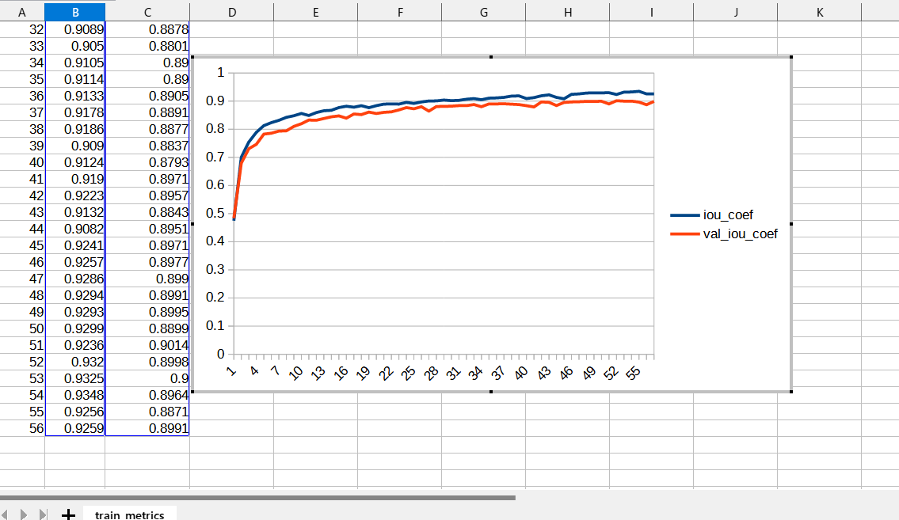

# Image-Segmentation-Pap-Smear (Updated: 2023/07/24)
<h2>
1 Image-Segmentation-Pap-Smear 
</h2>

This is an experimental project for Image-Segmentation of Pap-Smear by using
 <a href="https://github.com/atlan-antillia/Tensorflow-Slightly-Flexible-UNet">Tensorflow-Slightly-Flexible-UNet</a> Model,
which is a typical classic Tensorflow2 UNet implementation <a href="./TensorflowUNet.py">TensorflowUNet.py</a> 

The image dataset used here has been taken from the following web site.

<pre>
PAP-SMEAR (DTU/HERLEV) DATABASES & RELATED STUDIES
https://mde-lab.aegean.gr/index.php/downloads/
Part II : smear2005.zip [85.17 MB] New Pap-smear Database (images)
</pre>
<pre>
This is the new website that hosts the DTU/Herlev Pap Smear Databases, as well as selected studies and papers 
related to these data. For more than 10 years, Dr Jan Jantzen works on pap-smear data acquired from images of 
healthy & cancerous smears coming from the Herlev University Hospital (Denmark), thanks to Dr MD Beth Bjerregaard.
The Old Pap Smear Database was formed in the late 90’s while the New Pap Smear Database (improved) was formed 
within 2005. The analysis of these databases was made through several Master Theses most of which where elaborated 
in Denmark, under the supervision of Dr Jantzen, while he was joining DTU, Dept. of Automation (Denmark) and also 
through collaboration to other researchers from around the world, many of which were made with G.Dounias and his
research team of the MDE-Lab, University of the Aegean. During the last years, Dr Jantzen collaborates with the 
University of the Aegean, Dept. of Financial and Management Engineering (FME) as teaching associate of the 
Postgraduate Program of the FME-Dept. and as research associate of the MDE-Lab. The site will be continuously 
updated with new papers, studies, theses and citations related to the hosted pap-smear databases.

In case you use material from this site, please cite the current link and related studies.
</pre>
<li>
2024/07/24 Added <b>Seamless-Pap-Smear</b> to <b>./projects</b>.
</li>
 
Please see also: 
<a href="https://github.com/sarah-antillia/Pap-Smear-Segmentation-Dataset-Augmentation">Pap-Smear-Segmentation-Dataset-Augmentation</a>

 
<h2>
2. Install Image-Segmentation-Pap-Smear 
</h2>
Please clone Image-Segmentation-Pap-Smear.git in a folder <b>c:\google</b>. 
<pre>
>git clone https://github.com/sarah-antillia/Image-Segmentation-Pap-Smear.git 
</pre>
You can see the following folder structure in your working folder. 

<pre>
Image-Segmentation-Pap-Smear 
├─asset
└─projects
    ├─Pap-Smear
    │  ├─eval
    │  ├─generator
    │  ├─mini_test
    │  ├─models
    │  ├─Pap-Smear
    │  │  └─severe_dysplastic
    │  │      ├─test
    │  │      │  ├─images
    │  │      │  └─masks
    │  │      ├─train
    │  │      │  ├─images
    │  │      │  └─masks
    │  │      └─valid
    │  │          ├─images
    │  │          └─masks
    │  ├─test_output
    │  └─test_output_merged
    └─Seamless-Pap-Smear
        ├─eval
        ├─generator
        ├─mini_test
        ├─models
        ├─Seamless-Pap-Smear
        │  └─severe_dysplastic
        │      ├─test
        │      │  ├─images
        │      │  └─masks
        │      ├─train
        │      │  ├─images
        │      │  └─masks
        │      └─valid
        │          ├─images
        │          └─masks
        ├─test_output
        └─test_output_merged
</pre>

<h2>
3 Prepare dataset
</h2>

<h3>
3.1 Download master dataset
</h3>
  Please download the original image and mask dataset smear2005.zip from the following link 
<pre>
PAP-SMEAR (DTU/HERLEV) DATABASES & RELATED STUDIES
https://mde-lab.aegean.gr/index.php/downloads/
Part II : smear2005.zip [85.17 MB] New Pap-smear Database (images)
</pre>
The dataset <b>New database pictures</b> has the following folder structure, which contains seven categories. 
<pre>
./New database pictures
├─carcinoma_in_situ
├─light_dysplastic
├─moderate_dysplastic
├─normal_columnar
├─normal_intermediate
├─normal_superficiel
└─severe_dysplastic
</pre>
<h3>
3.2 Create image and mask dataset
</h3>
By using Python script <a href="./projects/Pap-Smear/generator/ImageMaskDatasetGenerator.py">ImageMaskDatasetGenerator.py</a>,
 we have created <b>Smear2005-master</b> dataset from the original image *.BMP files and mask *-d.bmp files
in each category under <b>New database pictures</b> folder. 
The script performs the following image processings. 
<pre>
1 Create square images from original BMP files in those categories.

2 Create square mask  corresponding to blue only regions in *-d.bmp mask files in those categories.

3 Create rotated and flipped images and masks of size 128x128 to augment the resized square images and masks.
</pre>

The created <b>Smear-2005-master</b> dataset has the following folder structure. 
<pre>
./Smear2005-master
├─carcinoma_in_situ
│  ├─images
│  └─masks
├─light_dysplastic
│  ├─images
│  └─masks
├─moderate_dysplastic
│  ├─images
│  └─masks
├─normal_columnar
│  ├─images
│  └─masks
├─normal_intermediate
│  ├─images
│  └─masks
├─normal_superficiel
│  ├─images
│  └─masks
└─severe_dysplastic
    ├─images
    └─masks
</pre>

<h3>
3.3 Split master/severe_dysplastic to test, train and valid 
</h3>
By using Python script <a href="./projects/Pap-Smear/generator/split_master.py">split_master.py</a>,
 we have finally created <b>Pap-Smear</b> dataset from the Smear-2005-master/severe_dysplastic. 
<pre>
./Pap-Smear
└─severe_dysplastic
    ├─test
    │  ├─images
    │  └─masks
    ├─train
    │  ├─images
    │  └─masks
    └─valid
        ├─images
        └─masks
</pre>
<b>train/images samples:</b> 

 
<b>train/masks samples:</b> 

 

<h2>
4 Train TensorflowUNet Model
</h2>
 We have trained Pap-Smear TensorflowUNet Model by using the following
 <b>train_eval_infer.config</b> file.  
Please move to ./projects/Pap-Smear directory, and run the following bat file. 
<pre>
>1.train.bat
</pre>
, which simply runs the following command. 
<pre>
>python ../../TensorflowUNetTrainer.py ./train_eval_infer.config
</pre>
, where train_eval_infer.config is the following.
<pre>
; train_eval_infer.config
; Dataset of Pap-Smear/severe_dysplastic 
; 2023/07/22 antillia.com

[model]
image_width    = 128
image_height   = 128

image_channels = 3
num_classes    = 1
base_filters   = 16
base_kernels   = (3,3)
num_layers     = 7
dropout_rate   = 0.07
learning_rate  = 0.0001
clipvalue      = 0.5
dilation       = (1,1)
loss           = "bce_iou_loss"
metrics        = ["iou_coef"]
show_summary   = False

[train]
epochs        = 100
batch_size    = 4
patience      = 10
metrics       = ["iou_coef", "val_iou_coef"]
model_dir     = "./models"
eval_dir      = "./eval"
image_datapath = "./Pap-Smear/severe_dysplastic/train/images"
mask_datapath  = "./Pap-Smear/severe_dysplastic/train/masks"
create_backup  = True

[eval]
image_datapath = "./Pap-Smear/severe_dysplastic/valid/images"
mask_datapath  = "./Pap-Smear/severe_dysplastic/valid/masks"
output_dir     = "./eval_output"

[infer] 
;images_dir = "./mini_test/"
images_dir = "./Pap-Smear/severe_dysplastic/test/images"
output_dir = "./test_output"
merged_dir = "./test_output_merged"

[mask]
blur      = True
binarize  = True
threshold = 60
</pre>

The training process has just been stopped at epoch 58 by an early-stopping callback as shown below.  
 
 
 
<b>Train metrics line graph</b>: 
 
 
<b>Train losses line graph</b>: 
 

<h2>
5 Evaluation
</h2>
 We have evaluated prediction accuracy of our Pretrained Pap-Smear Model by using <b>valid</b> dataset. 
Please move to ./projects/Pap-Smear/ directory, and run the following bat file. 
<pre>
>2.evalute.bat
</pre>
, which simply runs the following command. 
<pre>
>python ../../TensorflowUNetEvaluator.py ./train_eval_infer.config
</pre>
The evaluation result is the following. 
 
 

<h2>
6 Inference 
</h2>
We have also tried to infer the segmented region for 
<pre>
images_dir    = "./Pap-Smear/severe_dysplastic/test/images" 
</pre> dataset defined in <b>train_eval_infer.config</b>,
 by using our Pretrained Pap-Smear UNet Model. 
Please move to ./projects/Pap-Smear/ directory, and run the following bat file. 
<pre>
>3.infer.bat
</pre>
, which simply runs the following command. 
<pre>
>python ../../TensorflowUNetInferencer.py ./train_eval_infer.config
</pre>

<b><a href="./projects/Pap-Smear/Pap-Smear/severe_dysplastic/test/images">Test input images</a> </b> 
 
 
<b><a href="./projects/Pap-Smear/Pap-Smear/severe_dysplastic/test/masks">Test input ground truth mask</a> </b> 
 
 

<b><a href="./projects/Pap-Smear/test_output/">Inferred images </a>test output</b> 
 
 
 

<b><a href="./projects/Pap-Smear/test_output_merged">Inferred merged images (blended test/images with 
inferred images)</a></b> 
  

 
<!--
-->

<h2>
7 Train TensorflowUNet Model by Seamless-Pap-Smear
</h2>
Please move to ./projects/Seamless-Pap-Smear directory, and run the following bat file. 
<pre>
>1.train.bat
</pre>
The training process has just been stopped at epoch 57 by an early-stopping callback as shown below.  
 
 
 
<b>Train metrics line graph</b>: 
 
 
<b>Train losses line graph</b>: 
 

<h2>
8 Evaluation by Seamless Pretrained Model
</h2>
 We have evaluated prediction accuracy of our Pretrained Pap-Smear Model by using <b>valid</b> dataset. 
Please move to ./projects/Seamless-Pap-Smear/ directory, and run the following bat file. 
<pre>
>2.evalute.bat
</pre>

The evaluation result is the following. 
 
 

<h2>
9 Inference by Seamless Pretrained Model
</h2>

Please move to ./projects/Seamless-Pap-Smear/ directory, and run the following bat file. 
<pre>
>3.infer.bat
</pre>
<b><a href="./projects/Seamless-Pap-Smear/Pap-Smear/severe_dysplastic/test/images">Test input images</a> </b> 
 
 
<b><a href="./projects/Seamless-Pap-Smear/Pap-Smear/severe_dysplastic/test/masks">Test input ground truth mask</a> </b> 
 
 

<b><a href="./projects/Seamless-Pap-Smear/test_output/">Inferred images </a>test output</b> 
 
 
 

<b><a href="./projects/Seamless-Pap-Smear/test_output_merged">Inferred merged images (blended test/images with 
inferred images)</a></b> 
  

 
<h3>
References
</h3>
<b>1. PAP-SMEAR (DTU/HERLEV) DATABASES & RELATED STUDIES</b> 
<pre>
https://mde-lab.aegean.gr/index.php/downloads/
</pre>

<b>2. Liquid based cytology pap smear images for multi-class diagnosis of cervical cancer</b> 
<pre>
https://data.mendeley.com/datasets/zddtpgzv63/4
</pre>

<b>3. Pap-smear Benchmark Data For Pattern Classification </b>
Jan Jantzen, Jonas Norup , George Dounias , Beth Bjerregaard 
<pre>
https://www.researchgate.net/publication/265873515_Pap-smear_Benchmark_Data_For_Pattern_Classification
</pre>
<b>4. Deep Convolution Neural Network for Malignancy Detection and Classification in Microscopic Uterine Cervix Cell Images</b> 
Shanthi P B,1 Faraz Faruqi, Hareesha K S, and Ranjini Kudva 
<pre>
https://www.ncbi.nlm.nih.gov/pmc/articles/PMC7062987/
</pre>

<b>5. DeepCyto: a hybrid framework for cervical cancer classification by using deep feature fusion of cytology images</b> 
Swati Shinde, Madhura Kalbhor, Pankaj Wajire 
<pre>
https://www.aimspress.com/article/doi/10.3934/mbe.2022301?viewType=HTML#b40
</pre>

<b>6. EfficientNet-Pap-Smear</b> 
Toshiyuki Arai @antillia.com 
<pre>
https://github.com/atlan-antillia/EfficientNet-Pap-Smear
</pre>

<b>7. Pap-Smear-Segmentation-Dataset-Augmentation</b> 
Toshiyuki Arai @antillia.com 
<pre>
https://github.com/sarah-antillia/Pap-Smear-Segmentation-Dataset-Augmentation
</pre>
